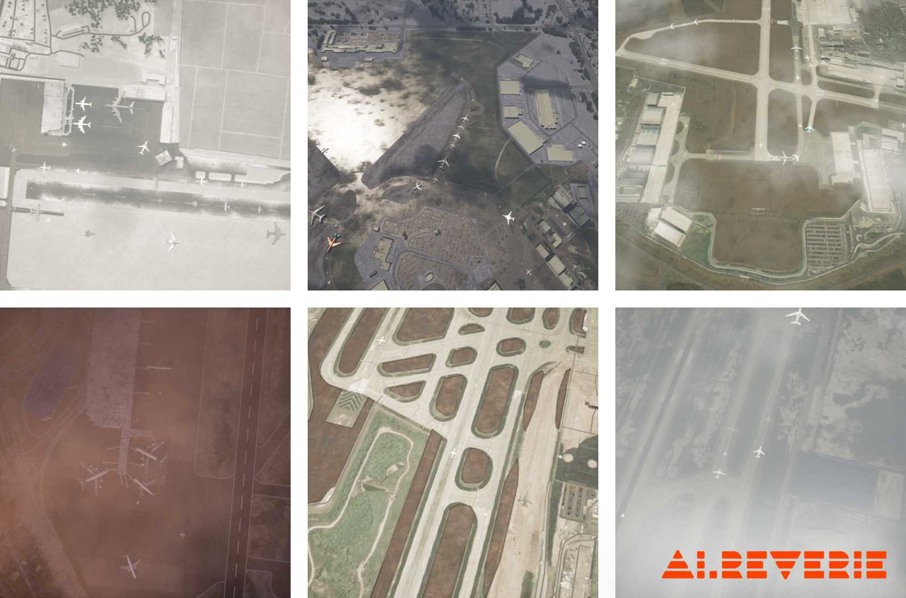

# RarePlanes: Synthetic Data Takes Flight



This repository contains scripts for inspection, preparation and evaluation of the RarePlanes dataset. 

The [user guide](https://www.cosmiqworks.org/rareplanes-public-user-guide/) provides a more detailed description of the dataset.

## Paper

```
@misc{shermeyer2020rareplanes,
    title={RarePlanes: Synthetic Data Takes Flight},
    author={Jacob Shermeyer and Thomas Hossler and Adam Van Etten and Daniel Hogan and Ryan Lewis and Daeil Kim},
    year={2020},
    eprint={2006.02963},
    archivePrefix={arXiv},
    primaryClass={cs.CV}
}
```
Please cite our paper if you find it useful for your research.


## Getting Started

### Using docker

We highly recommend using the available docker image as some of the dependencies can be strenous 
to install. You can either pull the image:

` docker pull aireverie/rareplanes:latest`

or build it locally:

`docker build -t rareplanes .`

### Without docker

Follow the installation guidelines of [solaris](https://github.com/CosmiQ/solaris). 

## Download data

Instructions are available in the user guide and [here](datasets/README.md).


## Models and baselines

We provide all the baseline results and made the trained models available for 
download [here](models/README.md)


## Create tiles from satellite images
Pre-tiled data can be found in the geojson_aircraft_tiled directory.  These data have a size of 512x512 pixels with an overlap of 20% per tile.  End users can retile their data if necessary.  

For example to tile into 1024x1024 tiles with no overlap:
```
python tools/create_tiles.py --image_dir datasets/real/train/PS-RGB
                             --geojson_dir datasets/real/train/geojson_aircraft
                             --tile_image_dir datasets/real/train/retiled_images
                             --tile_geojson_dir datasets/real/train/retiled_geojson
                             --tile_size 1024
                             --overlap 0
```
## Create coco files

Using the `create_coco_real.py` or `create_coco_synthetic.py`  script, the user can select the attribute that they want to use as a category.

### For aircraft detection

For example, to create a coco file where each object is labeled as aircraft, the following script is ran:
```
python tools/create_coco_real.py --image_dir datasets/real/train/PS-RGB_tiled
                            --geojson_dir datasets/real/train/geojson_aircraft_tiled
                             --output_path ./aircraft_real_coco.json
                             
python tools/create_coco_synthetic.py --data_dir datasets/synthetic/
                            --segmentation simple
                            --output_path ./aircraft_synthetic_coco.json
```

### For other attributes
If we want to classify the aircraft by number of engines instead:
```
python tools/create_coco_real.py --image_dir datasets/real/train/PS-RGB_tiled
                            --geojson_dir datasets/real/train/geojson_aircraft_tiled
                             --output_path ./num_engines_real_coco.json
                            --category_attribute num_engines
                            
python tools/create_coco_synthetic.py --data_dir datasets/synthetic/
                            --segmentation simple
                            --output_path ./num_engines_synthetic_coco.json
                            --category_attribute num_engines
```

### By role

```
python tools/create_coco_real.py --image_dir datasets/real/train/PS-RGB_tiled
                            --geojson_dir datasets/real/train/geojson_aircraft_tiled
                            --output_path ./role_real_coco.json
                            --category_attribute role
                           
python tools/create_coco_synthetic.py --data_dir datasets/synthetic/
                            --segmentation simple
                            --output_path ./role_synthetic_coco.json
                            --category_attribute role                          
```

### Create custom classes
If we want to identify aircraft based on a unique combination of classes:
```
python tools/create_custom_classes.py --all_annotations_geojson datasets/real/metadata_full_annotations/RarePlanes_Public_All_Annotations.geojson
                            --geojson_dir datasets/real/train/geojson_aircraft_tiled
                            --output_path datasets/real/train/geojson_aircraft_tiled_custom
                            --category_attributes ['num_engines', 'role', 'propulsion']
                            
                            
python tools/create_coco_real.py --image_dir datasets/real/train/PS-RGB_tiled
                            --geojson_dir datasets/real/train/geojson_aircraft_tiled_custom
                            --output_path ./custom_real_coco.json
                            --category_attribute custom_id
                            --custom_class_lookup_csv datasets/real/train/geojson_aircraft_tiled_custom/custom_class_lookup.csv
                            
                            
python tools/create_coco_synthetic.py --data_dir datasets/synthetic/
                            --segmentation simple
                            --output_path ./custom_synthetic_coco.json
                            --category_attribute custom_id
                            --custom_class_lookup_csv datasets/real/train/geojson_aircraft_tiled_custom/custom_class_lookup.csv
```

## Authors

* **[Thomas Hossler](thomas.hossler@aireverie.com)** 
* **[Jake Shermeyer](jshermeyer@iqt.org)**

